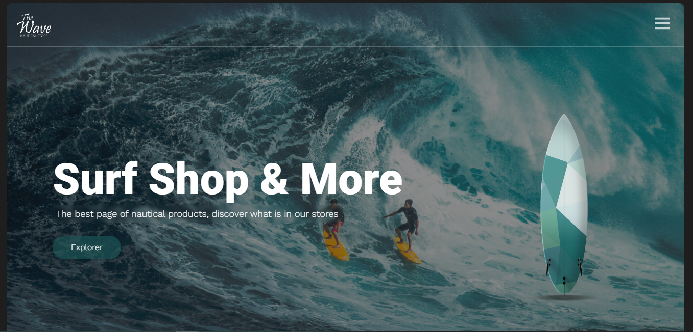
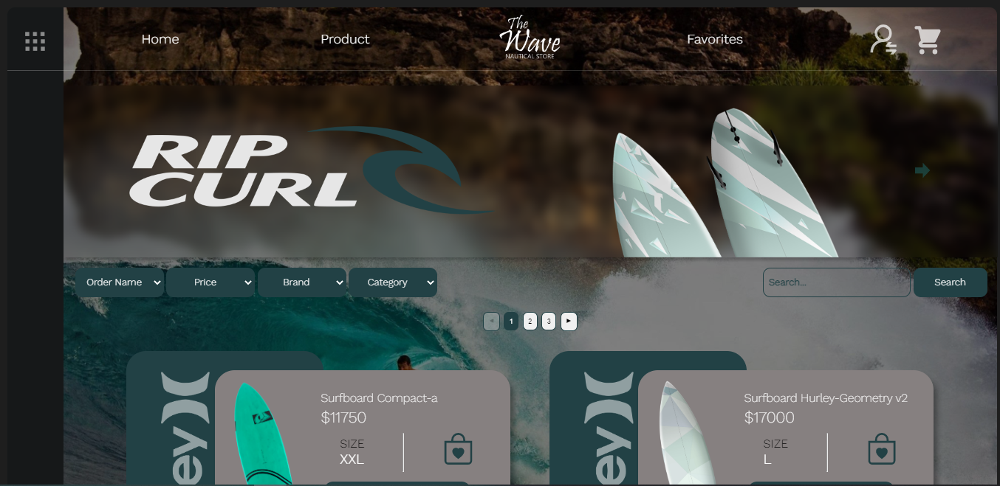
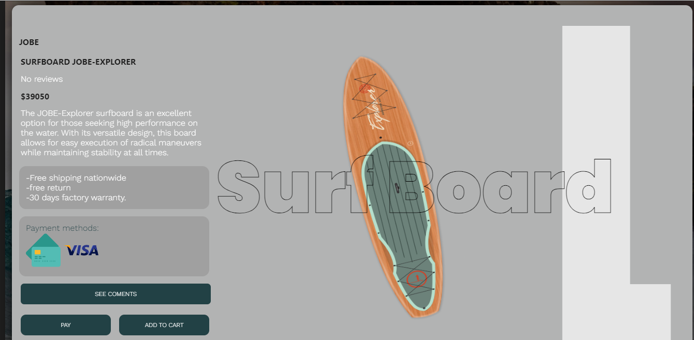
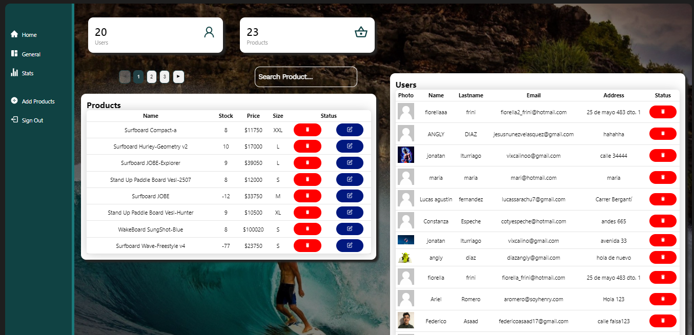
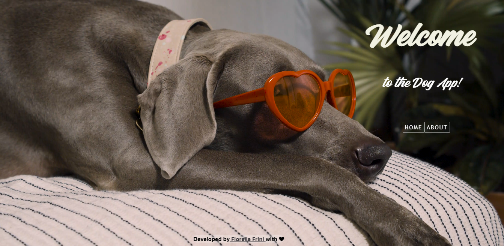
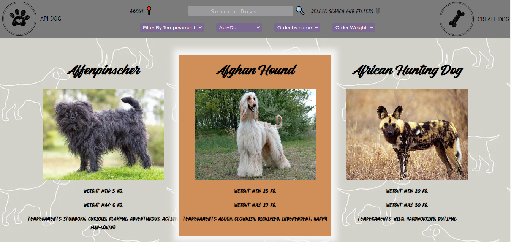
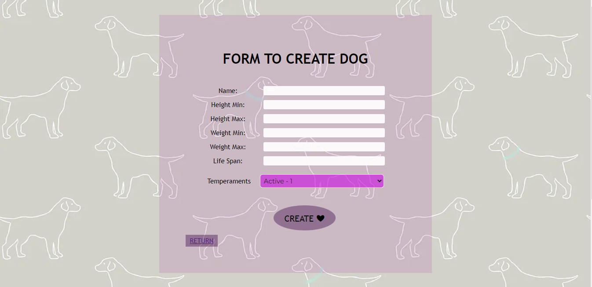
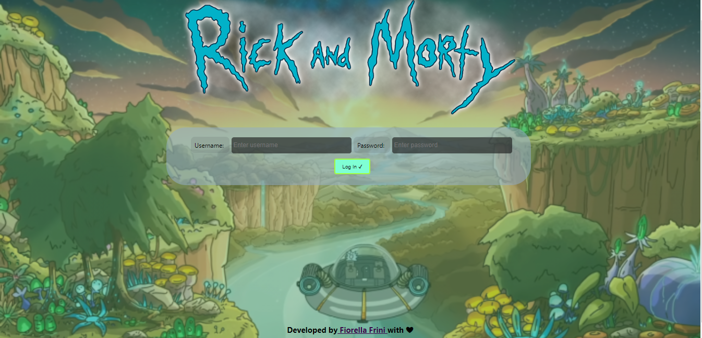
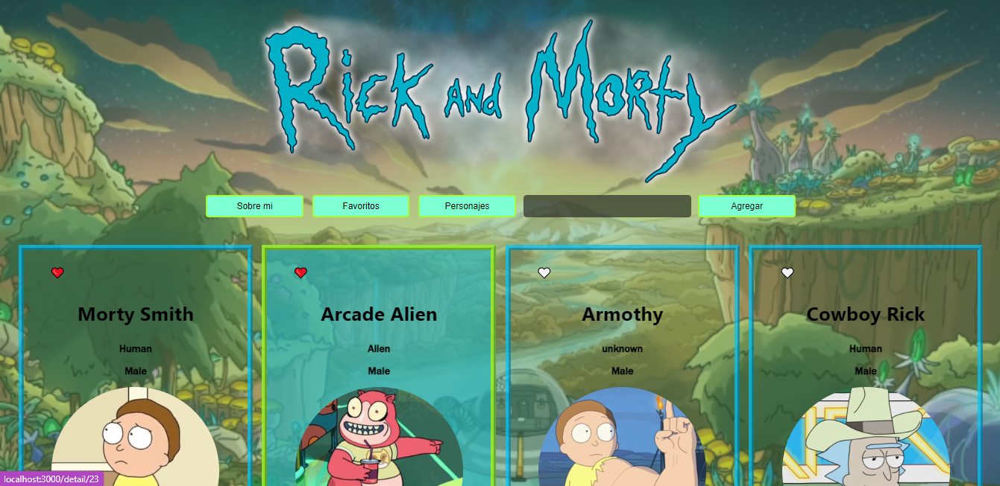

<h3>Mi nombre es Fiorella Frini, soy Desarrolladora Full Stack, tengo 31 años y vivo en Santiago del Estero, Argentina. Soy nacida en Argentina, pero cuento con ciudadanía Argentina e Italiana.</h3> 

*El mundo entero es mi techo!!🌎*

🚀La programacion entro en mi vida por el deseo de crecer, indagar, investigar y sumergirme en la tecnologia... en este mundo que transformo mis dias y los lleno de aprendizajes y desafios. 

🏀Además de la tecnología... mi pasión es la actividad física y la naturaleza. Soy Profesora de Educación Física.
Dicha profesión me permitió adquirir destrezas blandas útiles y favorables para el trabajo en equipo.
 <!-- el luchar por la excelencia, el liderazgo, el poder de empoderarse ante adversidades y problemáticas, el dominio y organización de grupos y el desarrollo de la creatividad...!  -->
Y asi es como la capacidad de moverme en todo aspecto de mi vida junto con el deseo de aprender me hizo sumergir en este mundo que me encanto!!! y me desafio...!

Realice mi formacion en #Henry en modalidad full time. Llenando mis dias de codigo y disciplina.

<h1>Tecnologias:</h1>
<!-- 📍Programming language: JavaScript. -->
<!-- 📍Web Technologies: NodeJS, CSS, HTML. -->
<!-- 📍Framework/ Libraries: ReactJS, Redux, Express. -->
<!-- 📍Database: PostgreSQL, Sequelize. -->
<!-- 📍Project Management: Trello, Slack. -->
<!-- 📍Version control: Git, Github. -->

| Front-End | Back-End | Data Base |  Gestion  |
| --------- | -------- | --------- | --------- |
| CSS       | NodeJS   | SQL       |  Trello   | 
| ReactJS   | Express  | PostgreSQL|  Slack    |
| Redux     |          |           |  Github   |
| HTML      |          |           |           |
| JavaScrip |          |           |           |

*Estoy 100% dispuesta al crecimiento en un ambiente de compañerismo y comunidad, entusiasmada en adquirir conocimientos nuevos y seguir desarrollando mis habilidades duras y blandas.*

*Me caracterizo por ser responsable y dar lo mejor de mi ante los objetivos que tengo por delante.*

 <h1>Contacto:</h1>

📫 fiorella_frini@hotmail.com

💬 +543541570774 (Argentina) 

📄 https://www.linkedin.com/in/fiorella-belen-frini-697442a7/

<h1>Mis Proyectos:</h1>

<h2>E-commerce The Wave Nautical Store</h2>
Participación en equipo de desarrollo ágil con metodología SCRUM en sprints de una semana presentando a un Product Owner avances en el desarrollo de la app, cuenta con funcionalidades como CRUD, auth, pasarelas de pago, dashboard, borrado logico, actualizacion de avances a traves de GITHUB, utilizando Trello y Discord. Tecnologías implementadas: React, Redux, Node, Sequelize, CSS, Express, MercadoPago, Cloudinary, SweetAlert, ChartJS.

[Link deploy 📍](https://proyecto-the-wave-client-1kip.vercel.app/)

<h2>Api Dogs</h2>
Tecnologías implementadas: React, Redux, Node, Sequelize, CSS, Express.

[Link deploy 📍](https://deploy-pi-front.vercel.app/)

<h2>Api Rick and Morty</h2>
Tecnologías implementadas: React, Redux, Node, Sequelize, CSS, Express.

<!-- [Link deploy 📍](https://deploy-pi-front.vercel.app/) -->

<!-- 
Gracias por la atención y haber llegado hasta aqui!!!

Atte. Fiorella. -->
